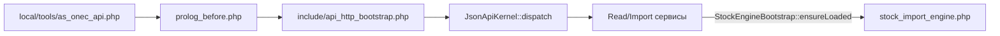

# Расширение модуля `as.onec_api` (для разработчиков и ИИ)

Краткая карта кода: куда вносить изменения, чтобы не ломать контракт HTTP и ленивую загрузку движка.

Пользовательский контракт, breaking changes и URL — в [README.md](README.md).

## Поток HTTP JSON API

- Точка входа: [local/tools/as_onec_api.php](../../tools/as_onec_api.php) (константы `STOP_STATISTICS` и т.д., затем prolog).
- После prolog: [include/api_http_bootstrap.php](include/api_http_bootstrap.php) — `Loader::includeModule('as.onec_api')`, создание [JsonApiKernel](lib/http/jsonapikernel.php).
- Процедурный движок [include/stock_import_engine.php](include/stock_import_engine.php) **не** подключается из [include.php](include.php); его подгружает [StockEngineBootstrap](lib/stock/stockenginebootstrap.php) после подключения `catalog` / `iblock`.

## Куда править

| Задача | Файл(ы) |
|--------|---------|
| Новый HTTP-маршрут | [lib/http/jsonapikernel.php](lib/http/jsonapikernel.php) — `routes()` и обработчик |
| Авторизация GET / query | [lib/http/apikeyguard.php](lib/http/apikeyguard.php); функции в [include/stock_import_engine.php](include/stock_import_engine.php) (`asStockApiAuthBySecretKey`, `asStockImportFrom1cAuth`) |
| Общий preflight чтения по `xml_id` | [lib/catalog/catalogreadpreflight.php](lib/catalog/catalogreadpreflight.php) — `CatalogReadPreflight` |
| Импорт остатков (строки, склады, ORM) | [include/stock_import_engine.php](include/stock_import_engine.php); обёртка [lib/stock/importservice.php](lib/stock/importservice.php) |
| Импорт цен | [lib/price/priceimportservice.php](lib/price/priceimportservice.php) |
| Чтение остатков / цен / товара | [lib/stock/stockreadservice.php](lib/stock/stockreadservice.php), [lib/price/pricereadservice.php](lib/price/pricereadservice.php), [lib/product/productreadservice.php](lib/product/productreadservice.php) |
| Лимиты и опции модуля | [lib/stockimportoptions.php](lib/stockimportoptions.php), [options.php](options.php) |
| Установка / синхрон версии | [install/index.php](install/index.php), [lib/installer.php](lib/installer.php) |
| Единый JSON-ответ | [lib/http/jsonresponse.php](lib/http/jsonresponse.php) (`api_version`) |

## Правило ленивой загрузки

Любой код, вызывающий функции из `stock_import_engine.php`, должен:

1. Выполнить `Loader::includeModule('catalog')` и `Loader::includeModule('iblock')` (или эквивалентную проверку).
2. Вызвать `StockEngineBootstrap::ensureLoaded()`.

Так сделано в guard, read/import сервисах и в [CatalogReadPreflight](lib/catalog/catalogreadpreflight.php).

## D7 ORM (ориентир)

Используются среди прочего: `ElementTable`, `PropertyTable`, `PropertyEnumerationTable`, `ProductTable`, `StoreTable`, `StoreProductTable`, `PriceTable`, `GroupTable`. Старый API каталога (`CIBlockElement::GetList` и т.п.) в модуле не используется для этих сценариев.

Исключение по ядру: после батча остатков при складском учёте может вызываться `\CCatalogStore::recalculateProductsBalances()` (см. комментарий `@todo` в [ImportService](lib/stock/importservice.php)).

## Ограничения проекта

- Кастомизация сайта — в `local/`; ядро `bitrix/` не править.
- ID инфоблоков и константы каталога — из `local/php_interface/include/config.php` (движок опирается на `IBLOCK_CATALOG`, SKU, опционально офферы и свойства склада).

## Чеклист регрессии после правок

- Маршруты и параметры из [README.md](README.md): `path=/v1/stocks`, `/v1/stocks/import`, `/v1/prices`, `/v1/products`.
- POST импорт остатков и цен: лимиты тела, авторизация ключом / `login`+`password` (только POST).
- GET с `access_key` в query или ключом в заголовке.
- Настройки модуля: права `>= W` на запись; сценарии из README (sessid намеренно не проверяется в форме).
- См. также [ADEV/stocks-import-from-1c-testing.md](../../../ADEV/stocks-import-from-1c-testing.md) при наличии.
