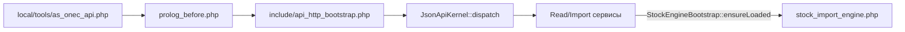

# Расширение модуля `as.onec_api` (для разработчиков и ИИ)

Краткая карта кода: куда вносить изменения, чтобы не ломать контракт HTTP и ленивую загрузку движка.

Пользовательский контракт, breaking changes и URL — в [README.md](README.md).

## Поток HTTP JSON API

- Рабочая точка входа веб-сервера: `local/tools/as_onec_api.php` ([относительно корня сайта](../../tools/as_onec_api.php)). Установка модуля в админке **не** копирует этот файл — эталон в репозитории: [tools/as_onec_api.php](tools/as_onec_api.php) (скопировать в `local/tools/`).
- После prolog: [include/api_http_bootstrap.php](include/api_http_bootstrap.php) — `Loader::includeModule('as.onec_api')`, создание [JsonApiKernel](lib/Http/JsonApiKernel.php).
- Процедурный движок [include/stock_import_engine.php](include/stock_import_engine.php) **не** подключается из [include.php](include.php); его подгружает [StockEngineBootstrap](lib/Stock/StockEngineBootstrap.php) после подключения `catalog` / `iblock`.
- [include.php](include.php) регистрирует **явный PSR-4** для `As\OnecApi\` (в дополнение к `.settings.php`), чтобы классы находились сразу после установки модуля и на Linux с регистрозависимыми путями.

## Куда править

| Задача | Файл(ы) |
|--------|---------|
| Скрипт точки входа `local/tools/` | Эталон в репозитории: [tools/as_onec_api.php](tools/as_onec_api.php) — на сайт копируется вручную, не через Install |
| Новый HTTP-маршрут | [lib/Http/JsonApiKernel.php](lib/Http/JsonApiKernel.php) — `routes()` и обработчик |
| Авторизация GET / query | [lib/Http/ApiKeyGuard.php](lib/Http/ApiKeyGuard.php); функции в [include/stock_import_engine.php](include/stock_import_engine.php) (`asStockApiAuthBySecretKey`, `asStockImportFrom1cAuth`) |
| Общий preflight чтения по `xml_id` | [lib/Catalog/CatalogReadPreflight.php](lib/Catalog/CatalogReadPreflight.php) — `CatalogReadPreflight` |
| Импорт остатков (строки, склады, ORM, валидация по строкам) | [include/stock_import_engine.php](include/stock_import_engine.php); обёртка [lib/Stock/ImportService.php](lib/Stock/ImportService.php) |
| Импорт цен (валидация по строкам, логирование батчей) | [lib/Price/PriceImportService.php](lib/Price/PriceImportService.php) |
| Импорт статусов заказов 1С -> Bitrix | `lib/Order/OrderStatusImportService.php`, `lib/Order/OrderResolver.php`, `lib/Order/OrderStatusMapper.php`, `lib/Order/StatusTransitionValidator.php` |
| Справочник складов (чтение / запись) | [lib/Store/StoreReadService.php](lib/Store/StoreReadService.php), [lib/Store/StoreWriteService.php](lib/Store/StoreWriteService.php) |
| Чтение остатков / цен / товара / заказов | [lib/Stock/StockReadService.php](lib/Stock/StockReadService.php), [lib/Price/PriceReadService.php](lib/Price/PriceReadService.php), [lib/Product/ProductReadService.php](lib/Product/ProductReadService.php), `lib/Order/OrderReadService.php` |
| Лимиты и опции модуля | [lib/StockImportOptions.php](lib/StockImportOptions.php), [options.php](options.php) |
| Установка / синхрон версии | [install/index.php](install/index.php), [lib/Installer.php](lib/Installer.php) |
| Единый JSON-ответ, общий 413 для импортов | [lib/Http/JsonResponse.php](lib/Http/JsonResponse.php) (`send`, `withApiVersion`, `payloadTooLarge`) |

## Правило ленивой загрузки

Любой код, вызывающий функции из `stock_import_engine.php`, должен:

1. Выполнить `Loader::includeModule('catalog')` и `Loader::includeModule('iblock')` (или эквивалентную проверку).
2. Вызвать `StockEngineBootstrap::ensureLoaded()`.

Так сделано в guard, read/import сервисах и в [CatalogReadPreflight](lib/Catalog/CatalogReadPreflight.php).

## D7 ORM (ориентир)

Используются среди прочего: `ElementTable`, `PropertyTable`, `PropertyEnumerationTable`, `ProductTable`, `StoreTable`, `StoreProductTable`, `PriceTable`, `GroupTable`. Старый API каталога (`CIBlockElement::GetList` и т.п.) в модуле не используется для этих сценариев.

Исключение по ядру: после обработки всего запроса остатков при складском учёте вызывается `\CCatalogStore::recalculateProductsBalances()` (см. комментарий `@todo` в [ImportService](lib/Stock/ImportService.php)).

## Актуальные правила импорта

- Нормализация входного JSON больше не должна «терять» строки: проверка обязательных полей и типов выполняется по каждой позиции, а ошибки накапливаются в `failed` / `errors`.
- Разрешение товара по `XML_ID` должно быть однозначным. Если найдено больше одного элемента каталога/ТП, строка считается ошибочной и не записывается.
- Для режима без складского учёта количество обновляется через модель каталога, а не через прямую запись в `ProductTable`.
- Для API статусов заказов поиск заказа идёт по `order_xml_id`/`order_id`, а при сохранении заказа выставляется флаг `$GLOBALS['AS_ONEC_API_SKIP_ORDER_MUTATORS']`, чтобы не сработали project-specific mutators из `city_handlers.php`.
- Для чтения заказов используйте `OrderReadService`, а не дублируйте сборку JSON ещё в одном HTTP-скрипте.

## Заказы и статусы

- Новые маршруты: `GET /v1/orders`, `POST /v1/orders/status`.
- Входящий код 1С сначала прогоняется через `OrderStatusMapper`; если JSON-мэппинг не настроен, код трактуется как внутренний `STATUS_ID` Bitrix.
- `StatusTransitionValidator` проверяет существование статуса, запрет смены статуса отменённого заказа и, при наличии, политику разрешённых переходов.
- Синхронизация оплат и отгрузок выключена по умолчанию и включается отдельными опциями модуля.
- `comment` из входящего события допустим только как служебная информация для лога интеграции; в `USER_DESCRIPTION` его не писать, потому что это пользовательское поле и оно выводится в личном кабинете.

## Ограничения проекта

- Кастомизация сайта — в `local/`; ядро `bitrix/` не править.
- ID инфоблоков и константы каталога — из `local/php_interface/include/config.php` (движок опирается на `IBLOCK_CATALOG`, SKU, опционально офферы и свойства склада).

## Чеклист регрессии после правок

- Маршруты и параметры из [README.md](README.md): `path=/v1/stocks`, `/v1/stocks/import`, `/v1/prices`, `/v1/products`, `/v1/orders`, `/v1/orders/status`, `GET/POST /v1/stores`.
- POST импорт остатков и цен: лимиты тела, авторизация ключом / `login`+`password` (только POST).
- GET с `access_key` в query или ключом в заголовке.
- Настройки модуля: права `>= W` на запись; сценарии из README (sessid намеренно не проверяется в форме).
- См. также [ADEV/stocks-import-from-1c-testing.md](../../../ADEV/stocks-import-from-1c-testing.md) при наличии.
